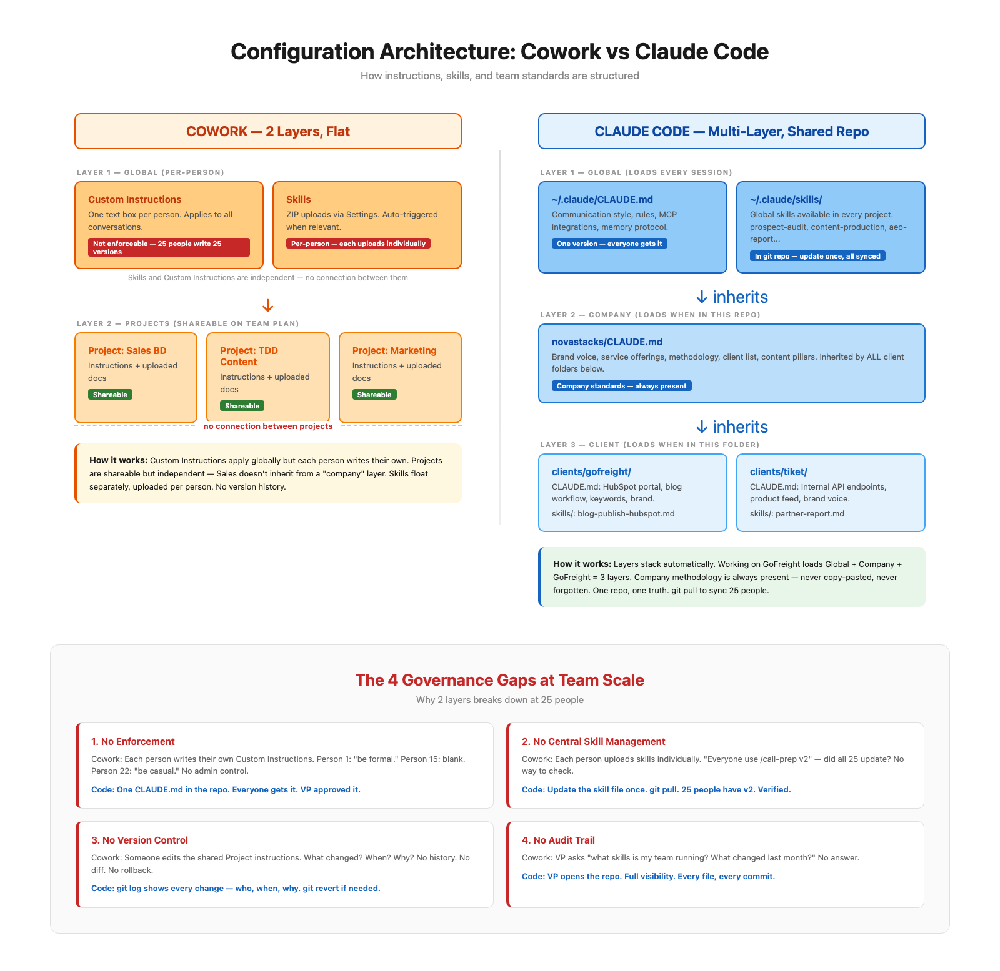

# tiket Workshop — Working Brief

| | |
|---|---|
| **Workshop** | Claude Code for B2B Marketing & Sales |
| **Format** | 3-Hour Hands-On Workshop |
| **Date** | 20 April 2026, afternoon (TBC) |
| **Location** | tiket Singapore office (with Kamal) |
| **Facilitators** | Novastacks AI x Superuser HQ |
| **Participants** | 25 people — B2B Sales, TDD (content/trends), Marketing & Content |
| **Base** | All Jakarta-based, 1 person (Kamal) in Singapore |

---

## What We Know

### Team Profile

- 25 participants using **Claude Cowork for 3 weeks** — experienced, not beginners
- Terminal/CLI already installed — no setup time needed
- Tool stack: Microsoft 365, Apollo.io, CapCut, internal APIs, product feeds, Google Drive

### What They Already Do in Cowork

| Capability | Status |
|---|---|
| LinkedIn scheduling | Working |
| Email (Gmail), Google Drive | Working |
| Excel data analysis, PPT creation | Working |
| Web browsing and research | Working |
| Scheduled/recurring tasks | Working |
| Skills (reusable, shareable on Team plan) | Working |
| Batch file operations | Working |
| Code execution (Python, Bash, Node.js) | Working |

### What They Want to Learn

| Team | Goals |
|---|---|
| **B2B Sales** | BD workflows, operational reporting ("look at my email every month, make a report"), hotel API channel management |
| **TDD / Content** | Content creation, viral/trending content identification, merchant content |
| **Marketing** | Content workflows, Gmail monitoring, campaign reporting |
| **All teams** | How to build large workflows, structure them, build agents |
| **VP** | Video content creation (follow up offline — too complex for 3hr workshop) |

---

## Cowork vs Code — The Two Real Differences

> **Golden rule for this workshop:** Do NOT spend time showing things Cowork already does. They'll be bored or annoyed. Focus only on what Code unlocks that Cowork genuinely cannot do.

### Difference 1: What Can You Connect To?

| | Cowork | Claude Code |
|---|---|---|
| **Pre-approved apps** (Gmail, Drive, Apollo, M365...) | Yes — 50+ connectors | Yes |
| **tiket internal hotel API** | No — not a pre-approved app | Yes — direct API call |
| **tiket product feeds** | No | Yes |
| **Higgsfield** (AI video generation) | No — no connector | Yes — direct API call |
| **CapCut** | No — no connector | Yes — community MCP server |
| **Any future tool without a connector** | No | Yes |

**The simple version:** Cowork can only talk to apps Anthropic has pre-approved. Code can talk to anything.

**Example — VP's video content workflow:**

| Step | Cowork | Code |
|---|---|---|
| 1. Write video script | Yes | Yes |
| 2. Call Higgsfield API to generate video | **No** | Yes |
| 3. Edit in CapCut | **No** | Yes |
| 4. Pull product data from internal API | **No** | Yes |
| 5. Save organized output | Yes | Yes |

3 out of 5 steps are Code-only. The entire video production pipeline needs Code.

---

### Difference 2: How Does the Team Stay Consistent?

Both Cowork and Code have instructions, skills, and memory. Cowork is not starting from zero — it has 2 layers. Code has unlimited layers. But the real issue isn't layers — it's four governance gaps at team scale.

#### Configuration Comparison

| Feature | Cowork | Claude Code |
|---|---|---|
| **Global instructions** | Custom Instructions — per-person, no enforcement | `~/.claude/CLAUDE.md` — one version, loads every session |
| **Project instructions** | Projects — shareable on Team plan | Project-level `CLAUDE.md` — loads when in that directory |
| **Company-wide layer** | None — must copy-paste into each Project | Company `CLAUDE.md` — auto-inherited by all sub-folders |
| **Skills** | ZIP uploads, per-person on claude.ai | Files in `.claude/skills/` — in git repo, shared |
| **Team sharing** | Projects shareable. Skills: individual upload. | Git repo — clone once, everyone synced |
| **Version control** | None | Full git history — who, when, what, why |
| **Persistence** | Memory within Projects only, not across standalone sessions | CLAUDE.md + memory persist across all sessions |

#### Visual: 2 Layers vs Multi-Layer (see diagram)

*(Diagram shows Cowork's flat 2-layer structure vs Code's multi-layer inherited structure using Novastacks as example)*

#### The 4 Governance Gaps

These aren't about features Cowork lacks. They're about what happens when 25 people need to work consistently.

| Gap | Problem in Cowork | Solution in Code |
|---|---|---|
| **1. No Enforcement** | Each person writes their own Custom Instructions. Person 1: "be formal." Person 15: blank. Person 22: "be casual." No admin control. | One CLAUDE.md in the repo. Everyone gets it. VP approved it. |
| **2. No Central Skill Management** | Each person uploads skills individually. "Use /call-prep v2" — did all 25 update? No way to check. | Update the skill file once. `git pull`. 25 people have v2. Verified. |
| **3. No Version Control** | Someone edits shared Project instructions. What changed? When? Why? No history. No rollback. | `git log` shows every change — who, when, why. `git revert` if needed. |
| **4. No Audit Trail** | VP asks "what skills is my team running? What changed last month?" No answer. | VP opens the repo. Full visibility. Every file, every commit. |

#### The Honest Assessment

| Team Size | Recommendation |
|---|---|
| 1 person | Cowork's 2 layers are fine |
| 3–5 people | Cowork's shared Projects mostly work, some manual coordination |
| **25 people across 3 teams** | The 4 governance gaps compound. Shared repo model solves all four. |

**The tradeoff:** Code requires learning terminal and git. Cowork is a GUI. For non-technical users, the learning curve is real. But for a team of 25 that wants consistency, the overhead pays for itself.

---

## Use Cases — What Code Can Do That Cowork Cannot

### Use Case 1: Full Video Content Pipeline

> **Context:** VP wants AI video content creation.

| | Detail |
|---|---|
| **Task** | Script → AI video → CapCut edit → product data → organized delivery |
| **Cowork** | Handles 2/5 steps (script + save). Blocked on Higgsfield, CapCut, internal API. |
| **Code** | Handles 5/5 steps. Calls Higgsfield API, uses CapCut MCP, pulls product data directly. |

### Use Case 2: Hotel Partner Performance Report

> **Context:** "Look at my email every month, pull partner numbers, make a report."

| | Detail |
|---|---|
| **Task** | Internal hotel API data + email context → enriched report |
| **Cowork** | Can read emails and summarize. Cannot access internal hotel API for actual booking/revenue data. Report is email-only. |
| **Code** | Calls internal API directly. Combines real performance data with email context. Richer, more accurate report. |

### Use Case 3: Meta Ad Intelligence → Product Ad Generator (Hero Demo)

> **Context:** "Find what competitors are running, then generate ads for our products."

| | Detail |
|---|---|
| **Task** | Scrape Meta Ad Library → store in Airtable → pull product data → generate ad package |
| **Cowork** | Can browse Meta Ad Library and push to Airtable (tested — works well, arguably better browsing quality). Blocked on internal product feed API. |
| **Code** | Completes the full pipeline. Adds internal API data, generates multi-file output (copy + shot list + CapCut brief), saves organized files. |

### Use Case 4: New Hire Onboarding

> **Context:** "Someone new joins the team. How fast are they productive?"

| | Detail |
|---|---|
| **Task** | New hire gets full team playbook — skills, standards, brand voice, workflows |
| **Cowork** | Manually share each Project, upload each skill individually. Days to set up. |
| **Code** | Clone the team repo. CLAUDE.md loads automatically. All skills available. Day 1 productivity. |

---

## Workshop Agenda (3 Hours)

### Block 1: Cowork vs Code — When Do You Need Code? (20 min)

**Time:** 0:00–0:20

**Objective:** Respect what they already know. Show only what's genuinely new.

| Segment | Duration | Content |
|---|---|---|
| Acknowledge Cowork | 5 min | "You've been using Cowork for 3 weeks. It works. We're not here to replace it." List what Cowork already does (they'll nod). |
| Difference 1: Connectivity | 8 min | "Cowork talks to pre-approved apps. Code talks to anything." Live demo: call an API Cowork can't reach (Higgsfield or internal API). Show the VP's video pipeline — 3/5 steps need Code. |
| Difference 2: Team governance | 7 min | Show the side-by-side diagram. "For 1 person, Cowork is great. For 25 people, you need a shared repo." Walk through the 4 governance gaps briefly. |

**Speaker notes:**
- Don't bash Cowork. They like it. They'll tune out if you start with "Cowork can't do X."
- Start with validation, then show the gap with a live demo.
- The video pipeline demo is the strongest hook — VP asked for this specifically.
- Keep the governance section brief here — Block 5 goes deeper.

---

### Block 2: How Code Works — The Basics (30 min)

**Time:** 0:20–0:50

**Objective:** Everyone can navigate files, create a CLAUDE.md, and run a skill.

| Segment | Duration | Content |
|---|---|---|
| Terminal basics | 10 min | `cd`, `ls`, `pwd` — navigate to a project folder. "This is where Code reads from." |
| CLAUDE.md | 10 min | What it is, where it goes, how layers stack (global → company → client). Follow-along: everyone creates their first CLAUDE.md with team brand voice. |
| Skills & /commands | 10 min | What a skill is (SKILL.md). How to invoke with `/`. Run a pre-built skill to see it work. |

**Speaker notes:**
- Go slow. These are non-technical users. Terminal is new for most.
- Use the Novastacks directory structure as the visual reference.
- The CLAUDE.md exercise is the first hands-on moment — make sure everyone completes it.
- Pre-built skill should be something visually impressive (content generation or research task).

**Skills reference for this block:**
- Overview: platform.claude.com/docs/en/agents-and-tools/agent-skills/overview
- Best practices: platform.claude.com/docs/en/agents-and-tools/agent-skills/best-practices
- Tutorial: claude.com/resources/tutorials/teach-claude-your-way-of-working-using-skills

---

### Block 3: Connecting to Your Systems + Building Skills (30 min)

**Time:** 0:50–1:20

**Objective:** Everyone understands how to call an API and build a reusable skill.

| Segment | Duration | Content |
|---|---|---|
| Calling an API | 10 min | Demo: call an external API from Code. Show the request, the response, what to do with the data. "This is the thing Cowork can't do." |
| Building a skill | 15 min | Walk through SKILL.md structure. Build a simple skill live. Save it. Run it with `/`. |
| Sharing a skill | 5 min | Put it in the shared folder. Another person runs it. Same output. "Build once, team runs." |

**Speaker notes:**
- The API demo should use something relevant to them (hotel data, travel API, or Higgsfield if access is available).
- Keep the skill simple — don't over-engineer. A 15-line SKILL.md that does something useful.
- The "sharing" moment is key — someone else in the room runs your skill and gets the same result.

---

### Break (15 min)

**Time:** 1:20–1:35

---

### Block 4: Breakout Build (50 min)

**Time:** 1:35–2:25

**Objective:** Each team builds one real skill they'll use after the workshop.

| Team | Skill to Build | What It Does |
|---|---|---|
| **Sales** | `/partner-report` or `/call-prep` | Pull from internal API (or mock) → enrich with email context → generate formatted report |
| **TDD / Content** | `/ad-intelligence` or `/content-sprint` | Scrape or research → Airtable → pull product data → generate ad/content package |
| **Marketing** | `/campaign-dashboard` | Pull data → Python analysis → formatted report with metrics |

**Facilitator notes:**
- Need at least 3 facilitators — one per breakout group.
- Pre-built skill templates should be ready. Teams customize, not build from scratch.
- If no internal API access, use a mock API or public travel API.
- Each group should have a working `/command` by the end of this block.

---

### Block 5: Show & Tell + Team Playbook (25 min)

**Time:** 2:25–2:50

**Objective:** Demo what each team built. Set up the team's shared repo structure.

| Segment | Duration | Content |
|---|---|---|
| Show & Tell | 15 min | Each group demos their skill (5 min each). Celebrate wins. |
| Team Playbook | 10 min | Set up the shared repo structure live: global CLAUDE.md + team skills folder. Discuss: who maintains skills? How does VP review? How do we onboard new hires? |

**Speaker notes:**
- The repo setup is the lasting takeaway. If they leave with a shared repo, the workshop succeeded.
- Frame it practically: "Next Monday, everyone `git pull` before starting work. That's it."
- Address the elephant: "Yes, git is new. But you only need 3 commands: `git clone`, `git pull`, `git push`."

---

### Buffer (10 min)

**Time:** 2:50–3:00

Q&A, individual help, next steps.

---

## What We Need to Prepare

### Content (Novastacks + Superuser HQ)

| Item | Status |
|---|---|
| Slides with two-difference framing (connectivity + team governance) | To do |
| Side-by-side architecture diagram (Cowork 2-layer vs Code multi-layer) | Done |
| Live demo: call an API Cowork can't reach (Higgsfield or internal API) | To do |
| CLAUDE.md template (global + project level) for hands-on exercise | To do |
| 3 breakout exercise briefs with pre-built skill templates | To do |
| Skills best practices handout (from official Anthropic docs) | Links ready |
| Updated cheatsheet for agents/skills | To do |
| Hero demo tested end-to-end (Meta Ad scraper → Airtable → product API → ad generation) | Scraper built, needs tuning |

### Still Need from tiket

| Item | Why |
|---|---|
| Confirm 20 April afternoon | Lock the date |
| Claude Code plan: Max or Business/Teams? | 25 people running agents = heavy token usage |
| Internal API documentation or sample endpoints | For demo and breakout exercises |
| Product feed format/access details | For hero demo |
| Venue tech: TV/monitor or Google Meet to cast to screen? | Logistics |
| Any data/content restrictions? | Determine if we use real or dummy data |

### Logistics

| Item | Notes |
|---|---|
| Facilitator count | Need 3+ for breakout sessions |
| Pre-workshop comms | Confirm Claude Code installed, login ready |
| Tech check | 15-min check day before or morning-of |

---

## Design Decisions (Tina + Yaohong)

1. **Internal API access** — Do we have a real tiket API for the demo, or do we mock one?
2. **Breakout structure** — Split by team (sales/TDD/marketing) or mixed groups?
3. **Terminal depth** — How much time on file system basics? They have CLI installed but comfort level unknown.
4. **CapCut/video workflow** — Include in workshop or offline follow-up with VP?
5. **Follow-up** — One-shot or ongoing support? Changes how ambitious we go.

---

## Reference Links

| Resource | URL |
|---|---|
| Skills Overview | platform.claude.com/docs/en/agents-and-tools/agent-skills/overview |
| What Are Skills | support.claude.com/en/articles/12512176 |
| Skills Best Practices | platform.claude.com/docs/en/agents-and-tools/agent-skills/best-practices |
| Skills Tutorial | claude.com/resources/tutorials/teach-claude-your-way-of-working-using-skills |
| Cowork Getting Started | support.claude.com/en/articles/13345190 |
